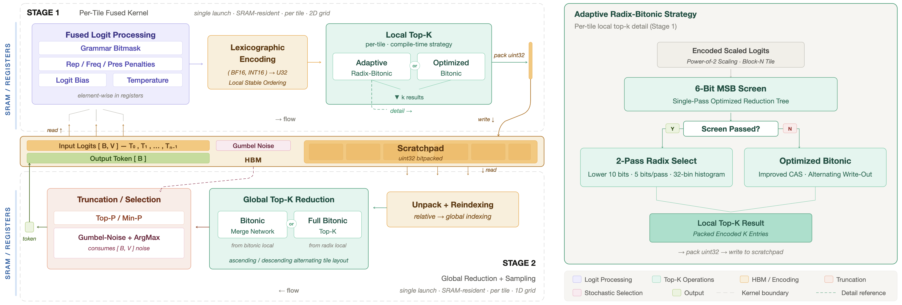

<br />
<div align="center">
  <picture>
    <source srcset="assets/dark.png" media="(prefers-color-scheme: dark)">
    
  </picture>
  <p><br /><br />
    <bold>Unified Tile-Aware Kernels for LLM Sampling and Speculative Verification</bold>
  </p>
</div>
<br />

<div align="center">

[](https://opensource.org/licenses/Apache-2.0)
[](https://www.python.org/downloads/)
[](#)
[](#)
[](#)
[](https://arxiv.org/abs/2607.20475)
[](https://www.alphaxiv.org/abs/2607.sonic-sampler)

</div>

## :rocket: Overview

SonicSampler is a unified suite of tile-aware Triton kernels that vertically fuses the complete LLM sampling pipeline (logit processing, probability truncation, token selection, and speculative verification) into a single, workload-aware, fully CUDA Graph–compatible execution model. It handles dynamic per-request sampling behaviors (grammar-constrained decoding, repetition / frequency / presence penalties, logit bias, temperature scaling, top-$k$ / top-$p$ / min-$p$ filtering, and speculative verification) without falling back to multiple kernel launches or assuming homogeneous batch behavior. At its core is a novel hierarchical two-stage top-$k$ algorithm that exploits the low-entropy structure of LLM outputs to enable efficient selection over large vocabularies, delivering up to **10× speedup** on top-$k$ selection and up to **16× speedup** end-to-end across heterogeneous speculative decoding workloads.

<br />
<div align="center">
  <picture>
    
  </picture>
</div>

## :nut_and_bolt: Public API

All three user-facing entry points live in `sonic_sampler.interface`.

### `UnshardedFusedSingular`

Single-step fused sampler with two modes: standard autoregressive generation (prefill or decode) and speculative drafting for decode, with optional cross-vocab (`d2t`) and slot-based indirection(s).

```python
from sonic_sampler.interface import UnshardedFusedSingular

sampler = UnshardedFusedSingular.initialize(vocab_size=V, batch_size=B, lookahead=γ)

# Standard generation.
selection = sampler.autoregressive(logits, buffers, prefill=False)

# Speculative drafting at timestep t.
draft = sampler.drafting(logits, buffers, timestep=t, tokens=tokens)
```

### `UnshardedFusedMultistep`

γ-lookahead fused sampler-verifier for speculative decoding. Consumes drafted tokens (and optionally their draft probabilities) and emits accepted + bonus tokens, log-probs, and top-$k$ log-probs in a single batched kernel.

```python
from sonic_sampler.interface import UnshardedFusedMultistep

verifier = UnshardedFusedMultistep.initialize(vocab_size=V, lookahead=γ, batch_size=B)
result = verifier(logits, tokens, buffers, probabilities=draft_probs)
```

### `UnshardedBoundedTopK`

Standalone tile-aware Top-$k$ primitive with bounded `k ≤ MAX_K`, useful for standalone top-$k$ evaluation.

```python
from sonic_sampler.interface import UnshardedBoundedTopK

topk = UnshardedBoundedTopK.initialize(vocab_size=V, batch_size=B, k=32)
values, indices = topk(logits)
```

## :wrench: Installation

```
uv pip install sonic-sampler
```

## :fire: Features

- Logit Processors:

  - Repetition Penalty
  - Frequency Penalty
  - Presence Penalty
  - Temperature
  - Top-K
  - Top-P
  - Min-P
  - Logit Bias
  - Logit Bit-Masking (Grammar)

- Selection / Verification Outputs:

  - Draft Probabilities
  - Token Log-Probabilities
  - Top-K Token Log Probabilities
  - Accepted & Next Tokens

- Verification Strategies

  - Greedy Acceptance
  - Stochastic Acceptance
  - Stochastic Acceptance with Greedy Drafting

- Extras

  - Gumbel-Max Sampling
  - Cross-Vocab Indirection (á la Eagle-3)
  - Variable-Length Verification
  - Programmatic-Dependent Launch (PDL)
  - Slot-Based Indirection

## :page_facing_up: Citation

If you use SonicSampler in your research, please cite:

```bibtex
@misc{ponnusamy2026sonicsampler,
      title={SonicSampler: Unified Tile-Aware Kernels for LLM Sampling and Speculative Verification},
      author={Pragaash Ponnusamy and Shivam Sahni and Jue Wang and Tri Dao},
      year={2026},
      eprint={2607.20475},
      archivePrefix={arXiv},
      primaryClass={cs.AI},
      url={https://arxiv.org/abs/2607.20475},
}
```
